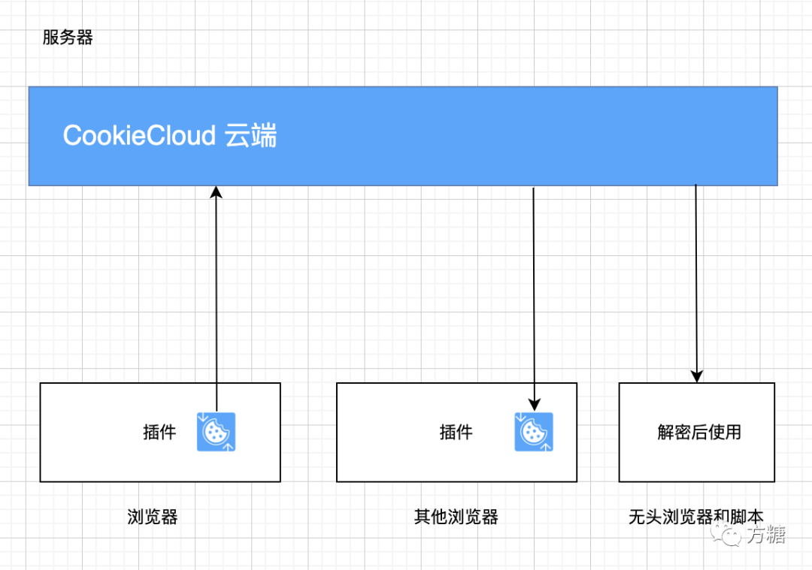

# CookieCloud

[中文](./README_cn.md) | [English](./README.md)


CookieCloud是一个和自架服务器同步Cookie的小工具，可以将浏览器的Cookie及Local storage同步到手机和云端，它内置端对端加密，可设定同步时间间隔。

> 最新版本支持了对同域名下local storage的同步

[Telegram频道](https://t.me/CookieCloudTG) | [Telegram交流群](https://t.me/CookieCloudGroup)

## ⚠️ Breaking Change

由于支持 local storage 的呼声很高，因此插件版本 0.1.5+ 除了 cookie 也支持了 local storage，这导致加密文本格式变化（从独立cookie对象变成{ cookie_data, local_storage_data }）。

另外，为避免配置同步导致的上下行冲突，配置存储从 remote 改到了 local，使用之前版本的同学需要重新配置一下。

对此带来的不便深表歉意 🙇🏻‍♂️


## 官方教程

  

1. 视频教程：[B站](https://www.bilibili.com/video/BV1fR4y1a7zb) | [Youtube](https://youtu.be/3oeSiGHXeQw) 求关注求订阅🥺
1. 图文教程：[掘金](https://juejin.cn/post/7190963442017108027)

## FAQ

1. 目前只支持单向同步，即一个浏览器上传，一个浏览器下载
2. 浏览器扩展只官方支持 Chrome 和 Edge。其他 Chrome 内核浏览器可用，但未经测试。使用源码 `cd extension && pnpm build --target=firefox-mv2` 可自行编译 Firefox 版本，注意 Firefox 的 Cookie 格式和 Chrome 系有差异，不能混用

  

## 浏览器插件

1. 商店安装：[Edge商店](https://microsoftedge.microsoft.com/addons/detail/cookiecloud/bffenpfpjikaeocaihdonmgnjjdpjkeo) | [Chrome商店](https://chrome.google.com/webstore/detail/cookiecloud/ffjiejobkoibkjlhjnlgmcnnigeelbdl)（ 注意：商店版本会因审核有延迟
1. 手动下载安装：见 Release

## 服务器端

### 第三方

> 由第三方提供的免费服务器端，可供试用，稳定性由第三方决定。感谢他们的分享 👏

> 由于部分服务器端版本较久，如测试提示失败可添加域名关键词再试

- <http://45.138.70.177:8088> 由[LSRNB](https://github.com/lsrnb)提供
- <http://45.145.231.148:8088> 由[shellingford37](https://github.com/shellingford37)提供
- <http://nastool.cn:8088> 由[nastools](https://github.com/jxxghp/nas-tools)提供
- <https://cookies.xm.mk> 由[Xm798](https://github.com/Xm798)提供
- <https://cookie.xy213.cn> 由[xuyan0213](https://github.com/xuyan0213)提供
- <https://cookie-cloud.vantis-space.com> 由[vantis](https://github.com/vantis-zh)提供
- <https://cookiecloud.25wz.cn> 由[wuquejs](https://github.com/wuquejs)提供
- <https://cookiecloud.zhensnow.uk> 由[YeTianXingShi](https://github.com/YeTianXingShi)提供
- <https://cookiecloud.ddsrem.com> 由[DDSRem](https://github.com/DDS-Derek)提供
- <https://cookiecloud.d0zingcat.xyz> 由[d0zingcat](https://github.com/d0zingcat)提供

### 自行架设

#### 方案一：通过Docker部署，简单、推荐方案

支持架构：linux/amd64,linux/arm/v7,linux/arm64/v8,linux/ppc64le,linux/s390x

##### 用 Docker 命令启动

```bash
docker run -p=8088:8088 easychen/cookiecloud:latest
```
默认端口 8088 ，镜像地址 [easychen/cookiecloud](https://hub.docker.com/r/easychen/cookiecloud)

###### 指定API目录·可选步骤可跳过

添加环境变量 -e API_ROOT=/`二级目录需要以斜杠开头` 可以指定二级目录:

```bash
docker run -e API_ROOT=/cookie -p=8088:8088 easychen/cookiecloud:latest
```

##### 用 Docker-compose 启动

```yml
version: '3'
services:
  cookiecloud:
    image: easychen/cookiecloud:latest
    container_name: cookiecloud-app
    restart: always
    volumes:
      - ./data:/data/api/data
    ports:
      - 8088:8088
```

[docker-compose.yml由aitixiong提供](https://github.com/easychen/CookieCloud/issues/42)

#### 方案二：通过 Node 部署

> 适用于没有 docker 但支持 node 的环境，需要自行先安装 node

```bash
cd api && yarn install && node app.js
```
默认端口 8088 ，同样也支持 API_ROOT 环境变量

## 调试和日志查看

进入浏览器插件列表，点击 service worker，会弹出一个面板，可查看运行日志

  

## API 接口

上传：

- method: POST
- url: /update
- 参数
  - uuid
  - encrypted: 本地加密后的字符串

下载：

- method: POST/GET
- url: /get/:uuid
- 参数：
   - password:可选，不提供返回加密后的字符串，提供则发送尝试解密后的内容；


## Cookie加解密算法

### 加密

const data = JSON.stringify(cookies);

1. md5(uuid+password) 取前16位作为key
2. AES.encrypt(data, the_key)

### 解密

1. md5(uuid+password) 取前16位作为key
2. AES.decrypt(encrypted, the_key)

解密后得到 data ，JSON.parse(data) 得到数据对象{ cookie_data, local_storage_data };

参考函数

```node
function cookie_decrypt( uuid, encrypted, password )
{
    const CryptoJS = require('crypto-js');
    const the_key = CryptoJS.MD5(uuid+'-'+password).toString().substring(0,16);
    const decrypted = CryptoJS.AES.decrypt(encrypted, the_key).toString(CryptoJS.enc.Utf8);
    const parsed = JSON.parse(decrypted);
    return parsed;
}
```

`extension/function.js` 查看更多

## 无头浏览器使用CookieCloud示例

请参考 `examples/playwright/tests/example.spec.js` 

```javascript
test('使用CookieCloud访问nexusphp', async ({ page, browser }) => {
  // 读取云端cookie并解密
  const cookies = await cloud_cookie(COOKIE_CLOUD_HOST, COOKIE_CLOUD_UUID, COOKIE_CLOUD_PASSWORD);
  // 添加cookie到浏览器上下文
  const context = await browser.newContext();
  await context.addCookies(cookies);
  page = await context.newPage();
  // 这之后已经带着Cookie了，按正常流程访问
  await page.goto('https://demo.nexusphp.org/index.php');
  await expect(page.getByRole('link', { name: 'magik' })).toHaveText("magik");
  await context.close();
});

```

### 函数

```javascript
async function cloud_cookie( host, uuid, password )
{
  const fetch = require('cross-fetch');
  const url = host+'/get/'+uuid;
  const ret = await fetch(url);
  const json = await ret.json();
  let cookies = [];
  if( json && json.encrypted )
  {
    const {cookie_data, local_storage_data} = cookie_decrypt(uuid, json.encrypted, password);
    for( const key in cookie_data )
    {
      // merge cookie_data[key] to cookies
      cookies = cookies.concat(cookie_data[key].map( item => {
        if( item.sameSite == 'unspecified' ) item.sameSite = 'Lax';
        return item;
      } ));
    }
  }
  return cookies;
}

function cookie_decrypt( uuid, encrypted, password )
{
    const CryptoJS = require('crypto-js');
    const the_key = CryptoJS.MD5(uuid+'-'+password).toString().substring(0,16);
    const decrypted = CryptoJS.AES.decrypt(encrypted, the_key).toString(CryptoJS.enc.Utf8);
    const parsed = JSON.parse(decrypted);
    return parsed;
}
```

## Python 解密

可参考这篇文章 [《Python 中 Crypto 对 JS 中 CryptoJS AES 加密解密的实现及问题处理》](https://blog.homurax.com/2022/08/12/python-crypto/) 或使用[PyCookieCloud](https://github.com/lupohan44/PyCookieCloud)

[python2实现](https://github.com/easychen/CookieCloud/issues/76)

[另一个使用实例](examples/decrypt.py)

## Go 解密算法

[感谢sagan分享](https://github.com/easychen/CookieCloud/issues/49) 

```go
package main

import (
	"bytes"
	"crypto/aes"
	"crypto/cipher"
	"crypto/md5"
	"crypto/sha256"
	"encoding/base64"
	"encoding/hex"
	"encoding/json"
	"errors"
	"fmt"
	"hash"
	"io"
	"log"
	"net/http"
	"os"
	"strings"
)

const (
	pkcs5SaltLen = 8
	aes256KeyLen = 32
)

type CookieCloudBody struct {
	Uuid      string `json:"uuid,omitempty"`
	Encrypted string `json:"encrypted,omitempty"`
}

func main() {
	apiUrl := strings.TrimSuffix(os.Getenv("COOKIE_CLOUD_HOST"), "/")
	uuid := os.Getenv("COOKIE_CLOUD_UUID")
	password := os.Getenv("COOKIE_CLOUD_PASSWORD")

	if apiUrl == "" || uuid == "" || password == "" {
		log.Fatalf("COOKIE_CLOUD_HOST, COOKIE_CLOUD_UUID and COOKIE_CLOUD_PASSWORD env must be set")
	}
	var data *CookieCloudBody
	res, err := http.Get(apiUrl + "/get/" + uuid)
	if err != nil {
		log.Fatalf("Failed to request server: %v", err)
	}
	if res.StatusCode != 200 {
		log.Fatalf("Server return status %d", res.StatusCode)
	}
	defer res.Body.Close()
	body, err := io.ReadAll(res.Body)
	if err != nil {
		log.Fatalf("Failed to read server response: %v", err)
	}
	err = json.Unmarshal(body, &data)
	if err != nil {
		log.Fatalf("Failed to parse server response as json: %v", err)
	}
	keyPassword := Md5String(uuid, "-", password)[:16]
	decrypted, err := DecryptCryptoJsAesMsg(keyPassword, data.Encrypted)
	if err != nil {
		log.Fatalf("Failed to decrypt: %v", err)
	}
	fmt.Printf("Decrypted: %s\n", decrypted)
}

// Decrypt a CryptoJS.AES.encrypt(msg, password) encrypted msg.
// ciphertext is the result of CryptoJS.AES.encrypt(), which is the base64 string of
// "Salted__" + [8 bytes random salt] + [actual ciphertext].
// actual ciphertext is padded (make it's length align with block length) using Pkcs7.
// CryptoJS use a OpenSSL-compatible EVP_BytesToKey to derive (key,iv) from (password,salt),
// using md5 as hash type and 32 / 16 as length of key / block.
// See: https://stackoverflow.com/questions/35472396/how-does-cryptojs-get-an-iv-when-none-is-specified ,
// https://stackoverflow.com/questions/64797987/what-is-the-default-aes-config-in-crypto-js
func DecryptCryptoJsAesMsg(password string, ciphertext string) ([]byte, error) {
	const keylen = 32
	const blocklen = 16
	rawEncrypted, err := base64.StdEncoding.DecodeString(ciphertext)
	if err != nil {
		return nil, fmt.Errorf("failed to base64 decode Encrypted: %v", err)
	}
	if len(rawEncrypted) < 17 || len(rawEncrypted)%blocklen != 0 || string(rawEncrypted[:8]) != "Salted__" {
		return nil, fmt.Errorf("invalid ciphertext")
	}
	salt := rawEncrypted[8:16]
	encrypted := rawEncrypted[16:]
	key, iv := BytesToKey(salt, []byte(password), md5.New(), keylen, blocklen)
	newCipher, err := aes.NewCipher(key)
	if err != nil {
		return nil, fmt.Errorf("failed to create aes cipher: %v", err)
	}
	cfbdec := cipher.NewCBCDecrypter(newCipher, iv)
	decrypted := make([]byte, len(encrypted))
	cfbdec.CryptBlocks(decrypted, encrypted)
	decrypted, err = pkcs7strip(decrypted, blocklen)
	if err != nil {
		return nil, fmt.Errorf("failed to strip pkcs7 paddings (password may be incorrect): %v", err)
	}
	return decrypted, nil
}

// From https://github.com/walkert/go-evp .
// BytesToKey implements the Openssl EVP_BytesToKey logic.
// It takes the salt, data, a hash type and the key/block length used by that type.
// As such it differs considerably from the openssl method in C.
func BytesToKey(salt, data []byte, h hash.Hash, keyLen, blockLen int) (key, iv []byte) {
	saltLen := len(salt)
	if saltLen > 0 && saltLen != pkcs5SaltLen {
		panic(fmt.Sprintf("Salt length is %d, expected %d", saltLen, pkcs5SaltLen))
	}
	var (
		concat   []byte
		lastHash []byte
		totalLen = keyLen + blockLen
	)
	for ; len(concat) < totalLen; h.Reset() {
		// concatenate lastHash, data and salt and write them to the hash
		h.Write(append(lastHash, append(data, salt...)...))
		// passing nil to Sum() will return the current hash value
		lastHash = h.Sum(nil)
		// append lastHash to the running total bytes
		concat = append(concat, lastHash...)
	}
	return concat[:keyLen], concat[keyLen:totalLen]
}

// BytesToKeyAES256CBC implements the SHA256 version of EVP_BytesToKey using AES CBC
func BytesToKeyAES256CBC(salt, data []byte) (key []byte, iv []byte) {
	return BytesToKey(salt, data, sha256.New(), aes256KeyLen, aes.BlockSize)
}

// BytesToKeyAES256CBCMD5 implements the MD5 version of EVP_BytesToKey using AES CBC
func BytesToKeyAES256CBCMD5(salt, data []byte) (key []byte, iv []byte) {
	return BytesToKey(salt, data, md5.New(), aes256KeyLen, aes.BlockSize)
}

// return the MD5 hex hash string (lower-case) of input string(s)
func Md5String(inputs ...string) string {
	keyHash := md5.New()
	for _, str := range inputs {
		io.WriteString(keyHash, str)
	}
	return hex.EncodeToString(keyHash.Sum(nil))
}

// from https://gist.github.com/nanmu42/b838acc10d393bc51cb861128ce7f89c .
// pkcs7strip remove pkcs7 padding
func pkcs7strip(data []byte, blockSize int) ([]byte, error) {
	length := len(data)
	if length == 0 {
		return nil, errors.New("pkcs7: Data is empty")
	}
	if length%blockSize != 0 {
		return nil, errors.New("pkcs7: Data is not block-aligned")
	}
	padLen := int(data[length-1])
	ref := bytes.Repeat([]byte{byte(padLen)}, padLen)
	if padLen > blockSize || padLen == 0 || !bytes.HasSuffix(data, ref) {
		return nil, errors.New("pkcs7: Invalid padding")
	}
	return data[:length-padLen], nil
}

```


## Deno 参考

[感谢JokerQyou分享](https://github.com/easychen/CookieCloud/issues/41)

```ts
import {crypto, toHashString} from 'https://deno.land/std@0.200.0/crypto/mod.ts'
import {decode } from 'https://deno.land/std@0.200.0/encoding/base64.ts'

const evpkdf = async (
  password: Uint8Array,
  salt: Uint8Array,
  iterations: number,
): Promise<{
  key: Uint8Array,
  iv: Uint8Array,
}> => {
  const keySize = 32
  const ivSize = 16
  const derivedKey = new Uint8Array(keySize + ivSize)
  let currentBlock = 1
  let digest = new Uint8Array(0)
  const hashLength = 16
  while ((currentBlock - 1) * hashLength < keySize + ivSize) {
    const data = new Uint8Array(digest.length + password.length + salt.length)
    data.set(digest)
    data.set(password, digest.length)
    data.set(salt, digest.length + password.length)
    digest = await crypto.subtle.digest('MD5', data).then(buf => new Uint8Array(buf))

    for (let i = 1; i < iterations; i++) {
      digest = await crypto.subtle.digest('MD5', digest).then(buf => new Uint8Array(buf))
    }
    derivedKey.set(digest, (currentBlock - 1) * hashLength)
    currentBlock++
  }
  return {
    key: derivedKey.slice(0, keySize),
    iv: derivedKey.slice(keySize),
  }
}

const main = async (env: Record<string, string>) => {
  const {
    COOKIE_CLOUD_HOST: CC_HOST,
    COOKIE_CLOUD_UUID: CC_UUID,
    COOKIE_CLOUD_PASSWORD: CC_PW,
  } = env
  const resp = await fetch(`${CC_HOST}/get/${CC_UUID}`).then(r => r.json())
  console.log(resp)
  let cookies = []
  if (resp && resp.encrypted)  {
    console.log(resp.encrypted)
    console.log(new TextDecoder().decode(decode(resp.encrypted)).slice(0, 16))
    const decoded = decode(resp.encrypted)
    // Salted__ + 8 bytes salt, followed by cipher text
    const salt = decoded.slice(8, 16)
    const cipher_text = decoded.slice(16)

    const password = await crypto.subtle.digest(
      'MD5',
      new TextEncoder().encode(`${CC_UUID}-${CC_PW}`),
    ).then(
      buf => toHashString(buf).substring(0, 16)
    ).then(
      p => new TextEncoder().encode(p)
    )
    const {key, iv} = await evpkdf(password, salt, 1)
    const privete_key = await crypto.subtle.importKey(
      'raw',
      key,
      'AES-CBC',
      false,
      ['decrypt'],
    )

    const d = await crypto.subtle.decrypt(
      {name: 'AES-CBC', iv},
      privete_key,
      cipher_text,
    )
    console.log('decrypted:', new TextDecoder().decode(d))
}
```


